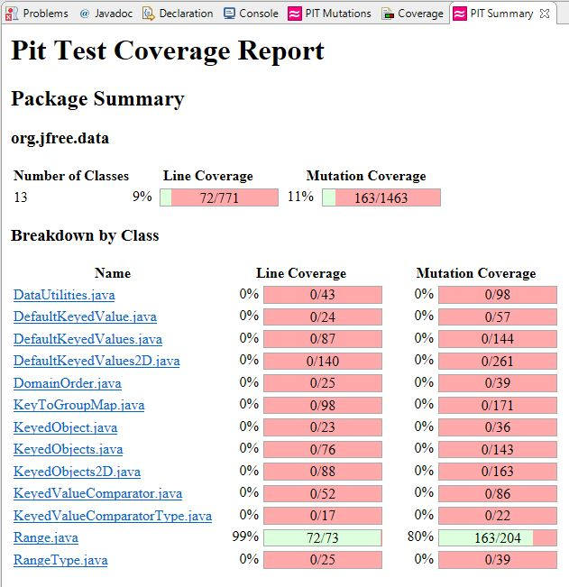
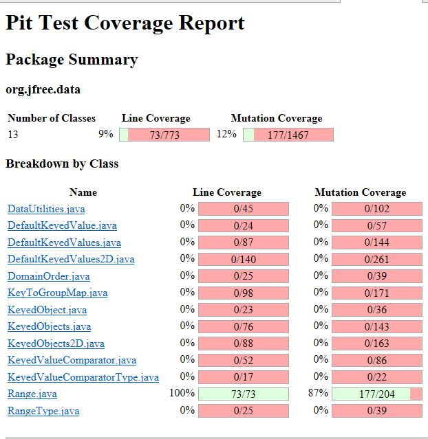
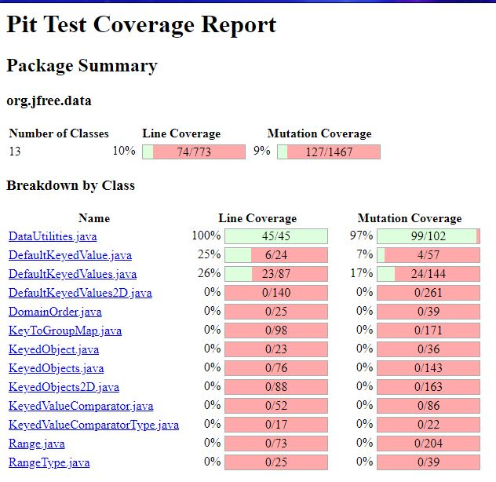
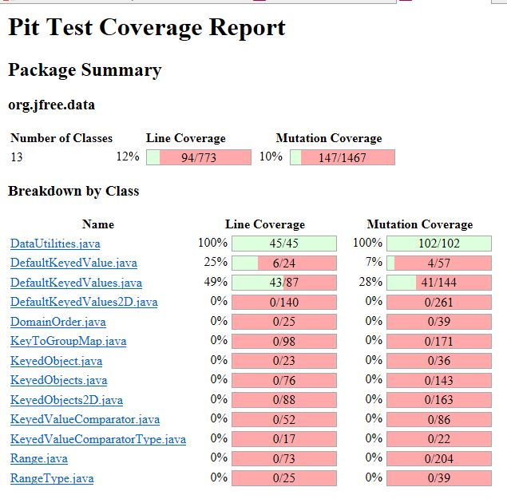

**SENG 438 - Software Testing, Reliability, and Quality**

**Lab. Report \#4 – Mutation Testing and Web App Testing**

| Group \#:      | 14                       |
|----------------|--------------------------|
| Student Names: | Yazan Chama - 30060793   |
|                | Luka Petrovic - 30077345 |
|                | Vu Ha(Martin) - 30068529 |
|                | Noah Bradley - 30063421  |

**1 Introduction**

In part one of this lab, the concept of mutation testing was explored
where we analyzed some of the test suites that we had written for the
DataUtilities and Range classes from the previous two assignments. The
purpose of this first section was to gain an understanding and practical
experience in running automatic mutation generators such as PIT and to
show us how effective it can be when it comes to improving a test suite.
Initially, mutation testing was done on the provided classes, followed
by a run on our own test cases – this helped us understand how our test
suite fared on a mutation testing level. Moreover, ten mutants in the
Range class were analyzed and a summary of why it was killed or survived
produced. The second part of this lab dealt with GUI Testing using the
Selenium IDE. This section introduced modern testing concepts of web
applications as we explored the IKEA website. Even though we knew this
site was going to be stable, testing can still provide insight on how to
improve your product. An alternative program, Sikulix was also explored
presenting advantages and disadvantages for different automation tools.
Unique features pertaining to each tool will be elaborated on further
into the report.

**2 Analysis of 10 Mutants of the Range class**

**2.1 Mutant \#1**

-   Line 85: removed conditional - replaced comparison check with false
    > in Range(double lower, double upper) constructor: KILLED

This mutant was created by replacing the if source code, which is
if(lower &gt; upper), to if(false). This mutant was killed by creating a
test case where lower is smaller than upper. As the result, even with
the mutant being injected, a Range with lower is smaller than upper is
still created.

**2.2 Mutant \#2**

-   Line 207: Remove call to Range::getLowerBound() in static Range
    > combine(Range range1, Range range2): SURVIVED

The mutant was created by modifying the source code to remove the call
to getLowerBound() in double l = Math.min(range1.getLowerBound()). We
weren’t able to kill this mutant since that requires modifying the
source code.

**2.3 Mutant \#3**

-   Line 139: changed conditional boundary in boolean contains(double
    > value): KILLED

This mutant was created by changing conditional statements in
return(value &gt;= this.lower && value &lt;= this.upper) to return &gt;
for &gt;= and &lt;= to &lt;. This mutant was killed successfully by
creating 3 test cases as follows:

value &gt; this.lower && value &lt;= this.upper,

value &gt; this.lower && value &lt; this.upper,

value &gt;= this.lower && value &lt; this.upper,

| Test Case Added | this.lower | this.upper | value |
|-----------------|------------|------------|-------|
| 1               | -1         | 1          | 1     |
| 2               | -1         | 4          | 0     |
| 3               | -1         | 1          | -1    |

**2.4 Mutant \#4**

-   Line 172: changed conditional boundary in double constrain(double
    > value): SURVIVED

The mutant was created by changing the condition if(value &gt;
this.upper) to if(value &gt;= this.upper). This mutant can’t be killed
since if a test case was created so that value &gt;= this.upper, then it
would not satisfy the pre-condition of if(!contains(value)) since if
value is &gt;= this.upper then it means that the range contains the
value and any statements after if(!contains(value)) would’ve never been
executed.

**2.5 Mutant \#5**

-   Line 324: changed conditional boundary in private static double
    > shiftWithNoZeroCrossing(double value, double delta): SURVIVED

This mutant was created by changing the else if statement from else
if(value &lt; 0.0) to else if(value &lt;= 0.0). This mutant was not
killed due to equivalence mutant, which is caused by the line below this
else if statement (i.e return Math.min(value + delta, 0.0)); that states
whether if value is less than or equal to 0, it always uses 0.0 in the
min calculation.

**2.6 Mutant \#6**

-   Line 171: negated conditional in double constrain(double value):
    > KILLED

Mutant is created by changing if(!contains(value)) to
if(contains(value)). This mutant was killed simply by logic since any
test case would kill this mutant. Suppose a value that is within the
range is passed before the mutant was created, then the result variable
will be set to value. After the mutant was created, it switched
if(!contains(value)) to if(contains(value)), and since value is within
the range so function contains will return true and the following
statements are executed. However, both the conditions if (value &gt;
this.upper) and else if (value &lt; this.lower) will not be executed
since they are both not satisfied, therefore, the result variable will
not change.

**2.7 Mutant \#7**

-   Line 156: Removed conditional, replaced conditional with false:
    > intersects(double value): return (upper &lt; this.upper &&
    > upper &gt;= lower) KILLED

The mutant that replaces this return with false is killed, as the test
is expected to catch cases where the range does not intersect

**2.8 Mutant \#8**

-   Line 127: Replaced double division with double multiplication:
    > getCentralValue():return this.lower / 2.0 + this.upper /
    > 2.0:KILLED

> The mutant that replaces this division by multiplication is killed
> which is expected, as the result to find central value logically
> depends on a division, except in some rare cases (range 0.0)

**2.9 Mutant \#9**

-   Line 118: Replaced subtraction with addition: getLength(): return
    > this.upper – this.lower:KILLED

> This mutant was killed because any value (except maybe for (0. 0))
> would result in a different outcome if the signs were reversed.

**2.10 Mutant \#10**

-   Line 229: Changed conditional boundary: expandToInclude(Range range,
    > double value): if(value &lt; range.getLowerBound()): SURVIVED

> This mutant survived because it is an equivalent mutation. If the &lt;
> was replaced with &lt;=, and the value was in fact equal this wouldn’t
> change the outcome since, line 236 in the else returns range. This
> cannot be fixed by adding any additional tests.

**3 Report all the statistics and the mutation score for each test
class**

**3.1 Range**

For Range class, coverage percentages for the previous code from
Assignment 3 are 99% for line coverage and 80% for mutation coverage.
For more details of previous assignment testing score, a picture of test
output is as follows:

There are multiple mutants that could be killed but were not killed in
the previous assignment, so we added more test cases to kill more
mutants as discussed in section 2 above. After adding the new test cases
and execute Pitest, the new mutation percentage and coverage percentage
are:

From the image above, the mutation coverage was increased from 80% to
87% by adding more test cases that cover conditional negations and
conditional changes. Line coverage is also increased from 99% to 100%,
which means every line in the class Range was tested.

**3.1 DataUtilities**

Despite Range class’ code from the previous assignment came with high
statistics on coverage percentage and mutation score, DataUtilities
provides even higher scores. For instance, line coverage in
DataUtilities is already at 100% before the execution of mutation
testing and mutation percentage is already at 97%. We were not able to
improve 10% as specified in the lab description due to the efficiency of
previous assignment code.

After adding just one more test case, which is adding the testing method
ValuesAreNullPercentageTest(), we finally cover some of the last mutants
that survived. For instance, this method tests for the behaviour of the
method getCumulativePercentage() in DataUtilities if one of the values
for KeyedValues is null.

After running mutation test, the statistics is as follows:

DataUtilities class’ mutation test came with 100% mutation coverage,
which means all mutants were killed. Additionally, line coverage is also
at 100% which indicates all lines in this class were tested at least
once.

**4 Analysis drawn on the effectiveness of each of the test classes**

The mutation coverage of the DataUtilities and Range classes that were
obtained, following the resolution of some issues on the source code and
test suite level, are as follows: 97% for DataUtilities and 80% for
Range. After running the mutation on the test suites for the respective
classes we reviewed the mutants that survived, and this allowed us to
identify many ways of how the test suite could be improved. For the most
part the test suites should have included more boundary tests, and this
is because many of the mutants that survived were the ones that
incremented or decremented a value. These mutants would have been easily
killed had an exhaustive boundary condition analysis been done and
applied. The strength of the DataUtilities mutation coverage indicates
that an excellent application of testing principles was actually applied
in most of the tests that were written. This high mutation coverage
indicates that the test suite is highly effective at killing mutants –
with the remaining caused by equivalent mutants.

**5 A discussion on the effect of equivalent mutants on mutation score
accuracy**

Equivalent mutants are mutants that do not change the outcome regardless
of how many new test cases were added; ie. The program with the added
mutants are equivalent to the original program. Having these types of
mutants present results in a lower score, because they survive (as they
are expected to do), despite them being mutants because the test suite
is designed to accept their outcome. To identify the equivalent mutants,
the best way to do so is to go through the source code after running the
PIT test, and as well as analyzing test suites and test inputs. This can
be seen in the Range test where the most we could achieve by adding
additional tests was 87% mutation coverage since the remaining mutations
were all equivalent mutants.

**6 A discussion of what could have been done to improve the mutation
score of the test suites**

The mutation score could have been enhanced by improving the test
coverage and or breadth of boundary conditions as explained in section
4. As many mutants that survived were caused by minor increments or
decrements of variables, which could have been killed had the test suite
been written with these mutations in mind. In addition, other mutations
such as negating a conditional or changing operations could have been
killed by implementing the test with that outcome in mind.

**7 Why do we need mutation testing? Advantages and disadvantages of
mutation testing**

Mutation testing is yet another method to enhance the effectiveness of a
test suite. The main purpose of mutation testing, is to test for
sturdiness and or robustness of the test suite, this has to do with that
fact that a change in the code that invalidates the result should be
caught by the test suite. A test suite that has weaker mutation coverage
implies that it is designed to conform to the source code rather than to
the expected outcome of the program, which is an indicator of a weak
test suite. Advantages of mutation testing include the ability to test
for robustness of the tests and detection of hidden defects that would
have not been found otherwise if blackbox and whitebox testing were the
only methods used. Another big advantage is that mutation testing can be
executed automatically, thanks to tools like PIT, which provide quick
feedback on whether the test suite is robust. Some disadvantages of
mutation testing include the computing power and time required to truly
test out an entire program. As a program grows (in lines of code and
complexity), it becomes prohibitive to test out mutations on every
single line, and as such a balance of time / thoroughness is needed.
Another disadvantage is the output of many equivalent mutants that can
induce confusion for the tester, especially if it is their first time
viewing the source code. Another related disadvantage is that this
testing method requires access to the source code, and is thus not
appropriate for black box testing.

**8 Explain your Selenium test case design process**

In order to efficiently create test cases for the IKEA webpage, our
group first decided to become familiar with the website. Getting
familiar with the website is an important aspect of the design process,
as you discover more and more features that are not prevalent to a new
user. We figured it would be a good idea to start with testing commonly
used features, such as logging in and adding items to the cart, as the
odds were good that these features would work correctly. This allowed us
to get a better grip with selenium itself. Next, we moved onto testing
not as commonly used features, such as changing the language ,to ensure
that the more niche website features functioned as intended. Most
websites are designed in a way that popular functionality is near the
top. Less commonly used functions such as changing the language of the
website can be found at the bottom of the website after scrolling to the
bottom of the window.

Once we decided on features to test, we provided different input data to
each feature’s tests to see if output would vary. Login data, website
language and changing default location are just a few different
functionalities that were tested on the IKEA website.

**9 Explain the use of assertions and checkpoints**

Assertions and checkpoints are useful as they provide confirmation that
certain webpage elements exist, or that the values of these elements are
correct. For example, one of our tests needed to assert that a text
element existed before it verified that the text itself was correct. A
selenium test doesn’t necessarily have to verify that something is
correct to pass, merely the given commands have to execute. This means
that adding assertions and verifications make the tests true tests, and
not just sequences of commands.

**10 How did you test each functionality with different test data**

For the GUI testing, we decided to test eight different functions of the
IKEA website. Below we will provide information about each test and the
different data that was provided on each test.

1.  Add item to shopping cart

    -   In this test, we conducted two different cases. We added a chair
        > and a desk to the shopping list, running the tests several
        > times to ensure a consistent result every time.

    -   Verification of the search bar being available was used in this
        > test case.

    -   There were no issues with this functionality of the GUI.

2.  Change store location

    -   Tested the change location feature of the website using multiple
        > locations. Regardless of what the previous location was, this
        > test would pick the same location every time. If the current
        > location is Edmonton, and we run a test to change the location
        > to Edmonton, the location will remain the same with no errors.

    -   Verification of the confirm button was used. This is to ensure
        > that the selected location actually does get selected with use
        > of the available button.

    -   There were no issues with this functionality of the GUI.

3.  Use help assistant

    -   Within the IKEA website, they have a help assistant that allows
        > you to ask questions in a text chat format. This test was
        > unique in a sense that the help assistant would only appear
        > sometimes. We are still unsure why the help assistant only
        > appears sometimes. We implemented two tests, one with a
        > waiting functionality and one without. Both tests still proved
        > to be inconsistent.

    -   Verification of the help assistant button was used in this test
        > case. This verification often presented an error as the help
        > assistant is not always available.

    -   Due to inconsistencies with the help assistant appearing on the
        > website, we can conclude that this is a bug within the site.
        > The user should be able to consistently access this feature
        > and also understand why it occasionally doesn't appear.

4.  Change website language

    -   For this test, we tried to pick a simple feature that would be
        > rarely used. Since there were only two options for languages,
        > we created two test cases. Changing the language of the
        > website proved to be consistent with no flaws.

    -   Used verification to ensure the change language option was
        > available. This verification is always evaluated to true.

    -   This feature worked as intended. No errors.

5.  Login

    -   The first variation of this test used a valid IKEA email and
        > password, and checked if submitting these inputs would direct
        > us to the profile dashboard.

    -   The next variation used an invalid email and password, and
        > checked if a form field error webpage element would be
        > generated upon submission.

    -   This feature worked as intended.

6.  Search for Product using its Article Number (Product Id)

    -   Both variations of this test used a product’s Article
        > Number(Ikea’s name for a product ID) as an input into the
        > search bar. They then checked if the correct product was
        > returned.

    -   This feature worked as intended.

7.  Add products to the Shopping List

    -   Both versions of this test involved logging in, adding one or
        > more products to the user’s Shopping List, and seeing if the
        > correct products appeared there.

    -   The first variant tested if one product could be successfully
        > added. The second checked if more than one product could be
        > added. Both variations worked without a hitch.

8.  Remove Products from the Shopping List

    -   This test logged into the site, added a product to the Shopping
        > List, and then attempted to remove it. If successful, the
        > product would no longer be in the Shopping List.

    -   The 2 variations of this test simply changed which products were
        > added/removed.

    -   This test worked as expected.

**11 Discuss advantages and disadvantages of Selenium vs. Sikulix**

Selenium is a browser extension that allows automation of features on a
website. Users can easily press record, interact with the website, then
instantly convert this series of commands into an automated test. This
process is extremely efficient, however it is limited and has a few
functionalities that could be tweaked. For starters, everytime you would
like to save a test case, you must re-download the entire project. This
makes it difficult to keep track of version history(rewrites the
previous saved project), as well as a cause for major annoyance when
working with the tool. On the contrary, Sikulix is also an automation
tool that allows you to automate almost any feature on a computer that a
normal user would do. Selenium is limited to a browser, however Sikulix
lets you interact with your operating system which is a very handy and
unique functionality. Unfortunately, there are also major drawbacks to
Sikulix. It takes a bit of time to learn the syntax and commands, and
once you do, it’s still not super efficient. Anything you want the
script to click on you must take a screenshot of. If your screenshot
does not include the entire button, there is a chance that the tool will
be unable to find the target. We also found that single and double
clicks sometimes do not perform as intended. A button that a user would
normally click once may require a double click when being scripted in
Sikulix.

Overall, we believe the Selenium is a good tool if you want quick
automation within websites, but no other real value in other situations.
Sikulix provides automation on all applications and even the OS of your
system. This versatility gives a lot more freedom towards what the user
can do. However, creating scripts is much more time consuming and
tedious. For a more versatile approach, we believe that Sikulix is the
more well-rounded option here.

**12 How the team work/effort was divided and managed**

Work was divided as evenly as possible while still keeping workflow
efficiency in mind. Two group members worked on the mutation testing,
while the other two worked on GUI testing. In order to familiarize each
other with the different areas of work, a meeting before the demo was
conducted to ensure all group members had understanding about all
different aspects of the assignment. We also used git to keep track of
our version history and exchange important files. The lab report was
completed by all group members, once again evenly distributing the
workload.

**13 Difficulties encountered, challenges overcome, and lessons
learned**

For part two of the lab, our group found it difficult to create quality
tests for such a well made website. Even though we do believe we found a
single bug (help assistant visibility is unpredictable), the rest of the
system appeared to be flawless. Learning how new tools work such as
Selenium and Sikulix is always a bit of a difficult process, however
once our group members started to use them we found it fairly intuitive.
Another difficulty we faced during part two was the inability to merge
projects. In order to do this, the project developer would have to copy
over line by line the project they want to merge. To avoid this, we
simply submit our two separate project files instead of wasting our time
copying over one of the projects into the other one.

**14 Comments/feedback on the lab itself**

For part 1 of this lab, it was hard to increase the mutation score of
range class by 10% if the original mutation score from the previous
assignment is already high. Some of the mutants weren’t killable due to
equivalent mutants or removing function calls in the source code.
Therefore, we think the improvement of 10% is only reasonable if the
mutation score originally was low. Moreover, our group found it
difficult to create tests for such a stable website. Part two of the
assignment felt like it was more about getting familiar with the
Selenium IDE rather than actually testing functionalities of a GUI. It
was extremely difficult to find functionalities of the website to test
which would have potential errors. Although part two of this lab was a
very nice introduction to automation, maybe a less stable GUI could be
used to get more familiar with a purposeful testing process.
